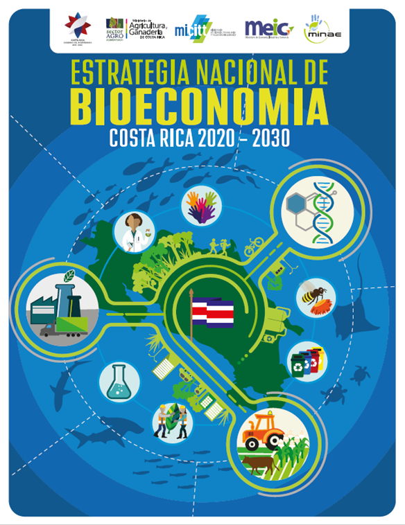
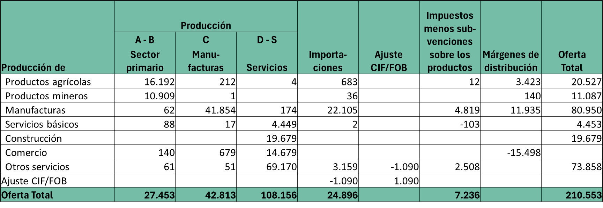
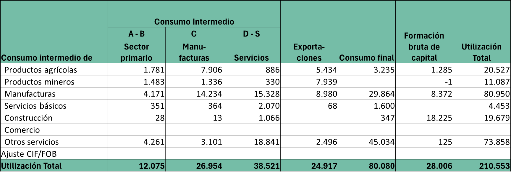
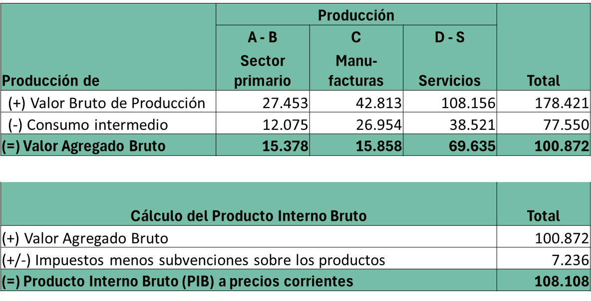
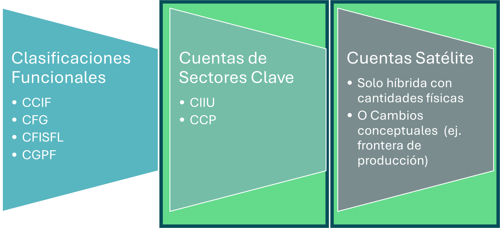
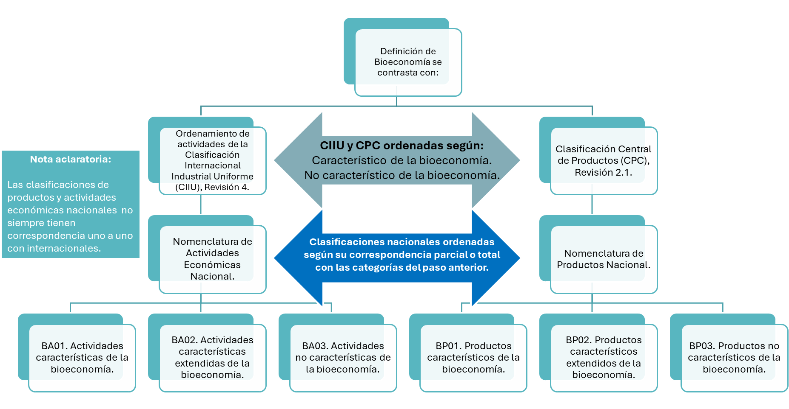

## Los productos bioeconómicos representan en promedio en Latinoamérica {.smaller}

::::::: columns
:::: {.column width="50%"}
::: incremental
-   [17.5%]{style="color:purple;"} de la producción a precios básicos.
-   [12.5%]{style="color:purple;"} de las importaciones.
-   [24.5%]{style="color:purple;"} de los impuestos sobre los productos.
:::
::::

:::: {.column width="50%"}
::: incremental
-   [8.6%]{style="color:purple;"} de los insumos de todas las industrias.
-   [27.9%]{style="color:purple;"} de las exportaciones.
-   [25.0%]{style="color:purple;"} del consumo final.
-   [3.7%]{style="color:purple;"} de la formación bruta de capital.
:::
::::
:::::::

# Definiciones

## Definiciones de Bioeconomía {.smaller}

:::::: columns
::: {.column width="30%"}

:::

:::: {.column width="70%"}
“La producción, utilización, conservación y regeneración de recursos biológicos, incluyendo los conocimientos, la ciencia, la tecnología y la innovación relacionados con dichos recursos, para proporcionar información, productos, procesos y servicios a todos los sectores económicos, con el propósito de avanzar hacia una economía sostenible.”

::: {style="text-align: right"}
---Gobierno de Costa Rica, 2020;   German Bioeconomy Council, 2018
:::
::::
::::::

## Definiciones de Bioeconomía {.smaller}

::::::: columns
::: {.column width="25%"}

:::

::: {.column width="25%"}

:::

:::: {.column width="50%"}
"La bioeconomía es la producción de bienes y servicios que se basa en el uso sostenible de los recursos biológicos y sus derivados obtenidos a partir de procesos productivos, para promover la creación de empleo y contribuir a la disminución de la pobreza."

::: {style="text-align: right"}
---Libro Blanco de la Bioeconomía Sustentable de Ecuador.
:::
::::
:::::::

## ¿Qué debe entenderse por bioeconomía? {.smaller}

::::::: columns
:::: {.column width="50%"}
::: incremental
-   Biomasa que se cultiva para producir alimentos, forrajes, fibras y energía.
-   Biomasa de los recursos marinos y acuicultura.
-   Biomasa forestal.
-   Biomasa residual en los sectores agropecuario, pesca y acuacultura, forestal y agroindustrial.
:::
::::

:::: {.column width="50%"}
::: incremental
-   Biomasa que se puede recuperar de los desechos urbanos.
-   Desechos líquidos de la ganadería y de la actividad humana.
-   Biodiversidad terrestre y marina, incluyendo la biodiversidad de aguas continentales.
:::
::::
:::::::

##  {background-image="images/paste-2.png"}

::: {style="color: white"}
¿Satélite de qué?
:::

# Cuentas Nacionales y Cuentas Satélite

## Cuentas Nacionales y Cuentas Satélite {.smaller}

::::::: columns
:::: {.column width="50%"}
::: incremental
[**Sistema de Cuentas Nacionales**]{style="color:teal;"}

-   Desempeño económico
-   La producción.
-   El consumo.
-   La distribución del ingreso.
-   El beneficio anual de las actividades económicas.
-   Tiene reglas estrictas contables, definiciones y clasificaciones.
:::
::::

:::: {.column width="50%"}
::: incremental
[**Cuentas Satélite**]{style="color:teal;"}

-   Extienden el alcance del Sistema de Cuentas Nacionales.
-   Hacen un acercamiento y aislan un tema en particular para revelar su valor.
-   Usan información complementaria pero compatible con el SCN (física por ejemplo).
-   En algunos casos, modifican definiciones.
:::
::::
:::::::

## Cuadro de oferta

## Cuadro de utilización

## Valor Agregado y Cálculo PIB (método de la producción)

# Metodología y abordaje

## Determinación del tipo de extension del Sistema de Cuentas Nacionales

## Abordaje de Cuentas de Sectores Clave

